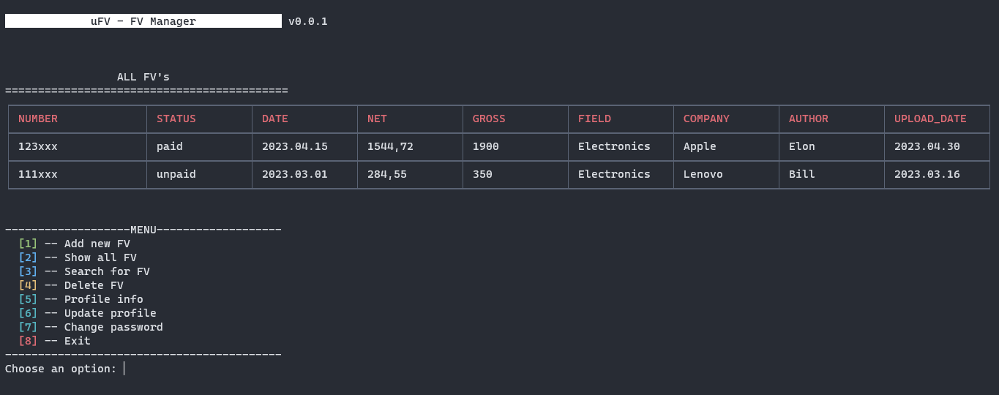

# uFV - VAT invoice manager
> This app was created for the purpose of completing the Client-server programming course.

[](https://forthebadge.com)



## Technologies

- [Node](https://www.python.org/) (v16.15.1) - JavaScript runetime environment
- [Express](https://www.pygame.org/news) (v4.18.1) -  framework for building RESTful APIs with Node.js
- [Passport](https://www.pygame.org/news) (v0.6.0) - authentication middleware for Node.js
- [Axios](https://www.pygame.org/news) (v1.3.4) - promise based HTTP client for the browser and node.js
- [Chalk](https://www.pygame.org/news) (v4.1.2) - module for text styling
- [CLI welcome](https://www.pygame.org/news) (v2.2.2) - welcome header for Node.js CLI software
- [CLI table](https://www.pygame.org/news) (v0.3.11) - unicode tables for the CLI

# Instruction
> General idea is to create local database with MongoDB, upload initial database structure, set up database related configs, install mandatory dependencies and run backend and frontend part of an app.

## Local database
> Prerequisites: install MongoDB and MongoDB Compass, and make sure that MongoDB Service is running on your machine.
1. Clone/pull repository
2. Open MongoDB Compass and create new connection: *mongodb://localhost:27017/fv*
3. Establish a connection
4. Create new database named: **fv**
5. Inside fv database create two collections: **organizations** and **users**
6. For **organizations** collection import file *'database-initial/organizations.json'*
7. For **users** collection import file *'database-initial/users.json'*
8. You can close MongoDB Compass but be sure that MongoDB Service is running

## Database config

1. In *./settings/common.json* file you can update variables if you want to deploy this app, or if you named database differently than it is said above
2. If you did everything like in instruction above you do not need to update anything

## Backend
> Prerequisites: install NodeJS version 16.15.1
1. Open *./panel* folder
2. Run
```sh
$ npm install
```

## Frontend
> Prerequisites: as above
1. Open *./console* folder 
2. Run
```sh
$ npm install
```

# Usage

## Backend
1. Open *./panel* folder
2. Run
```sh
$ npm run devStart
```
3. App will be listening at port *localhost:8080*

## Frontend
1. Open *./console* folder 
2. Run (in separate cmd)
```sh
$ node index.js
```
3. App will be running in terminal. Make sure that terminal window is big enough.

## Initial accounts
> Initially you can use two administrator accounts assigned for the same organization.
```sh
login: admin1
password: admin1
```
```sh
login: admin2
password: admin2
```

## License

All code is released under the [MIT](./LICENSE) License.

